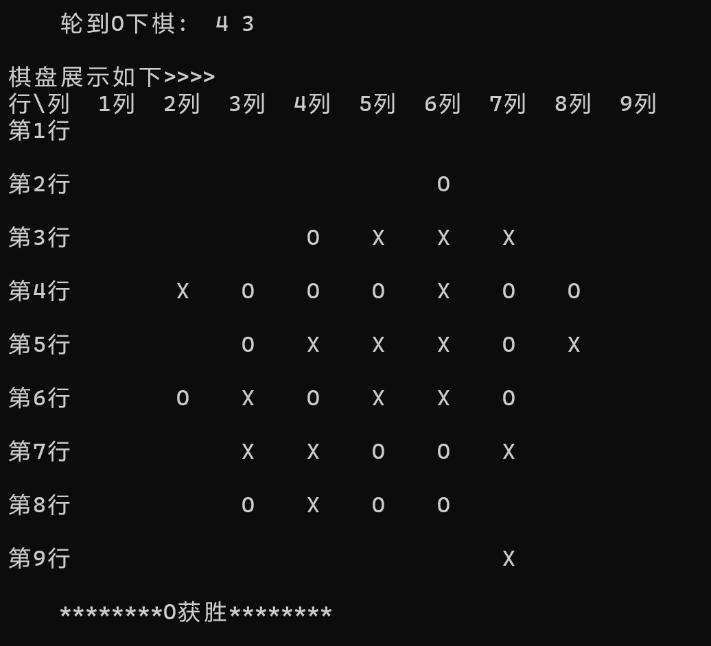

# C-LianzhuChess
本仓库存放大一做的C语言连珠棋控制台游戏, 留个纪念

## 版本说明
由于间隔时间比较长, 部分细节、思路忘了, 只能看源码粗略描述
1. [v1.0.0](https://github.com/existed-name/C-LianzhuChess/edit/main/TicTacToeV1.0.0.c)
   * 经典的 3 * 3 井字棋游戏
2. [v1.0.1](https://github.com/existed-name/C-LianzhuChess/blob/main/TicTacToeV1.0.1.c)
   * 展示棋盘时, 没放棋子的格子用空格而不是无效数字 -1 表示
   * 不再需要玩家输入棋子, 只需要输入坐标, 根据轮到哪个玩家下棋, 把相应的棋子放到坐标处
3. [v2.0.0](https://github.com/existed-name/C-LianzhuChess/blob/main/LianzhuChessV2.0.0.c)
   * 从单模式 → 多模式, `main` 函数负责运行主要逻辑, 由专门的跳转函数跳转到玩家选择的模式对应的函数
   * 但是仅开放井字棋模式、五子棋模式、自定义模式, 其他模式只是预设( 只有相关的介绍、枚举类和 `switch` 分支, 还没有实现功能的函数 )

## 下载说明
1. 下载整个仓库: 仓库首页右上部分 → 绿色的 "<> Code" → Local → Download Zip
2. 只下载某一个文件
   进入该文件, 在代码框右上角
   * 选择 `Copy row file` 复制代码粘贴到编译器上
   * 或者 `Download row file` 下载文件
3. 下载特定文件夹:    
   1. 进入特定文件夹, 复制网址到 [DownGit](https://tool.mkblog.cn/downgit/#/home) 上进行下载    
   2. 在英文输入法下按 "," 或者 "." 键 → 进入 github.dev 线上 VScode → 在左边选择资源管理器 → 右键指定文件夹, 下载到电脑指定位置    
   3. 使用其他插件、网站    
4. 使用 Git 命令下载

## 其他仓库
* C 语言
  - [猜数游戏](https://github.com/existed-name/C-GuessNumber/tree/main)
  - [线性数据结构](https://github.com/existed-name/C-LinearDataStructre)
  - [二叉树节点序号的二进制表示法](https://github.com/existed-name/C-TreeNodeNumberInBinary)
* Java
  - [健康计算器](https://github.com/existed-name/Java-Health-Calculator)
 
---

## 附
当时和室友一起玩的时候发现[判定机制算法]()有 bug, 一时没看出问题在哪, 就等它吃灰了...  

